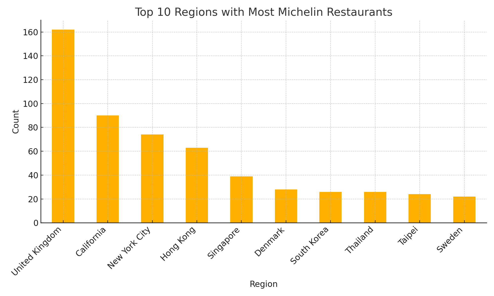

# 🍽️ Michelin Restaurants Analysis

This project analyzes and visualizes Michelin Guide restaurant data from around the world. Using Python, pandas, Matplotlib, and Folium, it uncovers insights on regional distribution, star ratings, cuisine trends, and more.

---

## 📊 Project Overview

Key analyses and visualizations:

1. **Top 10 Regions**  
   Bar chart of the ten regions with the most Michelin-starred restaurants.

2. **Nordic Countries Comparison**  
   Bar chart showing the number of Michelin restaurants in Sweden, Norway, Iceland, Denmark, and Finland.

3. **Star Distribution in Sweden**  
   Bar chart showing how many 1-star, 2-star, and 3-star restaurants are in Sweden.

4. **Top 10 Swedish Cuisines**  
   Bar chart of the most common cuisines among Swedish Michelin restaurants.

5. **Global Cuisine Trends**  
   Bar chart of the top 20 cuisines represented in the entire dataset.

6. .**Price Category vs. Stars**  
   Line chart showing how many restaurants fall into each price category (Plus, Premium, Premium Plus) for each star level.

7. **Interactive Map**  
   Folium map plotting all restaurants, with marker size proportional to star rating

---

## 🛠️ Technologies & Libraries

- **Python 3.11+**  
- **pandas** for data loading and manipulation  
- **Matplotlib** for static charts  
- **Folium** for interactive maps  
- **Modular project structure**:
  - `Dataset.py` — dataset path enumeration  
  - `Util.py` — data loading, cleaning, and model classes  
  - `graph.py` — reusable chart functions  
  - `analysis.py` — specific analysis & plotting routines  
  - `solution.ipynb` — Jupyter Notebook demonstrating all analyses

---

## 🚀 Getting Started

1. **Clone the repository**  
   ```bash
   git clone https://github.com/your-username/project-3-michelin.git
   cd project-3-michelin
   ```

2. **Install dependencies**  
   ```bash
   pip install pandas matplotlib folium
   ```

3. **Run the notebook**  
   ```bash
   jupyter notebook solution.ipynb
   ```

4. **Or use Python scripts**  
   ```python
   from Dataset import Dataset
   from Util import load_restaurants
   import analysis as a

   restaurants = load_restaurants(Dataset.MICHELIN.value)

   a.plot_top_regions(restaurants)
   a.plot_nordic_histogram(restaurants)
   a.plot_swedish_stars(restaurants)
   a.plot_swedish_cuisine(restaurants)
   a.plot_global_cuisine(restaurants)

   m = a.plot_map(restaurants)
   m.save("michelin_map.html")

   a.plot_price_category(restaurants)
   ```

---

## 📁 Repository Structure

```
project-3-michelin/
├── datasets/
│   └── michelin-restaurants.csv
├── Dataset.py
├── Util.py
├── graph.py
├── analysis.py
├── solution.ipynb
└── README.md
```

---

## 📈 Sample Output

  


---

## ✨ Author

**Your Name**  
[LinkedIn](https://www.linkedin.com/in/paulino-leticia/) · [GitHub](https://github.com/letpaulino)

> ⭐ If you enjoy this project, please give it a star!